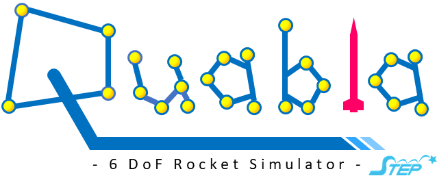

Quabla
==
6-DoF Rocket Simulator for STEP 
coding UTF-8

## Libraries
Jsonファイルを読み込むために，以下のライブラリが必要。
Jacksonで読み込んでいる。
* jacson-core
* jackson-annotations
* jackson-databind

ダウンロードは[こちらのサイト](https://www.sejuku.net/blog/39599)を参照のこと。

## Reference
* 戸川隼人，石黒登美子；スピンを伴うロケットの運動を計算するプログラム，航空宇宙技術研究所資料 NAL TM-145，1968
* 嶋田有三，佐々修一；飛行力学，森北出版，2017

## Useage
1. 実行時のコマンドラインで機体の諸元を入力したjsonファイルを指定。 
パスの指定方法は相対パスでも絶対パスでもどちらでもよい。
例えば，あらかじめ入っている`sample_rocket.json`を相対パスで指定する場合，
コマンドライン引数は`sample_rocket.json`となる。 
`C:\hoge`にある`rocket_config.json`を絶対パスで指定する場合，
コマンドライン引数は`C:\hoge\rocket_config.json`となる。
2. `QUABLA.java`を実行。

## Rocket Configurations
### Caution
* jsonの文法にの取って記入すること。
例えば，
	* 負の値を入力している（特に減衰モーメント係数。プログラム内で自動で修正してくれる）
	* コロンが無い，逆にコロンが必要ない 
などの文法ミスに注意。

* jsonファイルをUTF-8で編集しているか必ず確認

* 長さなどの定義に注意。長さの基準が異なっている可能性がある。

### Solver
ソルバーに関する設定。
|項目|備考|
|---|---|
|Name|プロジェクト名や機体名など|
|Result Filepath|結果の出力先。|
|Simulation Mode|'single'か'multi'を指定。|
|Time Step|シミュレーションの時間刻み。|

`'single'` `'multi'`の各モードについては以下の通り。 
|項目|説明|
|---|---|
|'single'|単一条件での計算。位置や姿勢角の時間履歴などを見たい場合はこのモードを選択。|
|'multi'|複数条件での計算。落下分散を計算したい場合に選択。singleモードと異なり位置などの時間履歴は出力されず，落下地点や最高高度などの表のみ出力。|

### Multi Solver
複数条件のシミュレーション時の設定。
|項目|単位|備考|
|---|---|---|
|Minimum Wind Speed | m/s | 計算する風速の最小値。|
|Step Wind Speed | m/s || 風速の時間刻み。|
|Number of Wind Speed | - | 計算する風速の数。|
|Number of Wind Azimuth | -  | 計算する風向の数。基本的に4の倍数にすること。|

### Structure
構造に関するパラメータ。 
|項目|単位|備考|
|Length|m|機体全長。ノーズコーン先端から機体後端まで。ボートテイルを有する場合はボートテイル後端まで。ノズルカバーは含めない。|
|Diameter|m|機体代表直径。|
|Dry Mass|kg|乾燥時（酸化剤を除いた）の機体重量。|
|Dry Length-C.G. from Nosetip|m|乾燥時の機体重心とノーズコーン先端の距離。|
|Dry Moment of Inertia Roll-Axis|kg*m^2|乾燥時のロール軸回りの慣性モーメント。|
|Dry Moment of Inertia  Pitch-Axis|kg*m^2|乾燥時のピッチ軸回りの慣性モーメント。|
|Upper Launch Lug|m|1本目のランチラグとノーズコーン先端の距離。ランチラグが3本以上の場合，機体後端から2本目のランチラグとの距離にすること。|
|Lower Launch Lug|m|機体後端から最も近いランチラグとノーズコーン先端との距離。|

### Engine
エンジンに関するパラメータ。 
|項目|単位|備考|
|---|---|---|
|Thrust Curve|-|推力履歴のcsvファイルのパス。|
|Nozzle Throat Diameter|mm|ノズルスロートの直径|
|Nozzle Expansion Ratio|-|ノズル開口比。ノズルの出口面積とスロートの面積比とすること。|
|Burn Time|sec|燃焼時間。作動時間とは異なる。|
|Isp|sec|平均比推力。|
|Tank Volume|cc|酸化剤タンクの容量。|
|Oxidizer Density|kg/m^3|酸化剤密度。
|Length Fuel-C.G. from End|m|機体後端から燃料（グレイン，固形燃料）重心までの距離。インジェクターベルは燃料重心に含めない。|
|Length Tank-End from End|m|機体後端から酸化剤タンク口金までの距離。|
|Fuel Mass Before|kg|燃焼前燃料重量。|
|Fuel Mass After|kg|燃焼後燃料重量|
|Fuel Outside Diameter|mm|燃料外径。|
|Fuel Inside Diamter|mm|燃焼前の燃料内径。|
|Tank Diameter|mm|タンク外径。|
|Fuel Length|m|燃料長さ。インジェクターベル含めず。|
|Tank Length|m|タンク長さ。|

### Parachute
### Wind

## Problem
* Mac OSで使用する場合，文字コードのせいか階層を区切る`\\`が文字化けしてしまい，
ディレクトリの指定で失敗する。 
`QUABLA.java`中の`\\`を`/`に変更するとうまくいく。

## Future Works
* 変数が発散したときの例外処理
* gui化 → 現状，CUIを検討
* マルチスレッド化（現状のコードでも速度自体は十分。今後計算条件が増えるなら実装の必要あり）